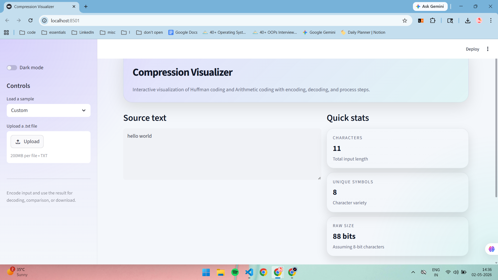
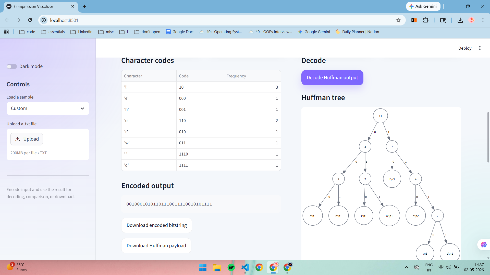
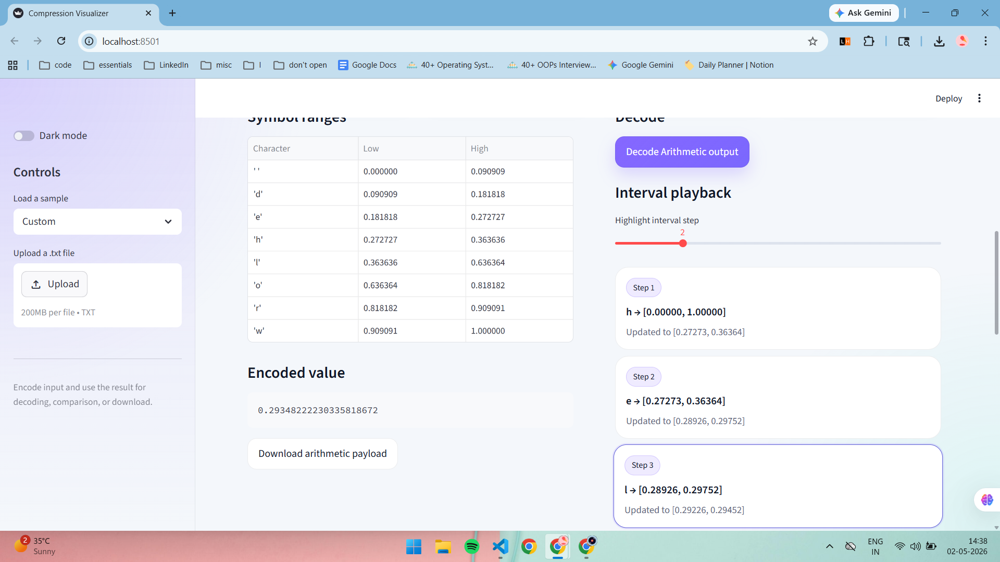

# 🚀 Compression Visualizer

<div align="center">

 <!-- TODO: Add project logo -->

[](https://github.com/keesha-luthra/compression-visualizer/stargazers)
[](https://github.com/keesha-luthra/compression-visualizer/network)
[](https://github.com/keesha-luthra/compression-visualizer/issues)
[](LICENSE)

**An interactive web application to visualize and compare data compression algorithms.**

[Live Demo](https://demo-link.com) <!-- TODO: Add live demo link (e.g., Streamlit Cloud) --> |
[Documentation](https://docs-link.com) <!-- TODO: Add documentation link if available -->

</div>

## 📖 Overview

The Compression Visualizer is an intuitive, interactive web application designed to demystify the inner workings of various data compression algorithms. Built with Streamlit, this tool allows users to input text or data, select from different compression techniques (e.g., Huffman, Lempel-Ziv), and observe step-by-step how the data is processed, compressed, and decompressed. It aims to provide an educational platform for students, developers, and enthusiasts to understand complex algorithmic concepts through direct engagement and visual feedback, making the principles of data compression clear and accessible.

## ✨ Features

-   🎯 **Interactive Data Input**: Easily input custom text or data to be compressed.
-   📚 **Multiple Algorithm Support**: Explore and compare various popular compression algorithms (e.g., Huffman Coding, Lempel-Ziv variants).
-   📊 **Real-time Visualization**: Witness the compression process unfold with graphical representations of data structures (e.g., Huffman trees, dictionary builds).
-   📉 **Compression Ratio Analysis**: Instantly view and compare the compression efficiency of different algorithms.
-   ⚙️ **Step-by-Step Execution**: Optionally, step through the algorithm's execution to understand each phase.
-   🔗 **Intuitive Streamlit UI**: A clean and easy-to-use interface built entirely in Python.

## 🖥️ Screenshots

### Main Interface


### Huffman Coding


### Arithmetic Coding


## 🛠️ Tech Stack

**Application Framework:**


## 🚀 Quick Start

Follow these steps to get the Compression Visualizer up and running on your local machine.

### Prerequisites
-   **Python 3.8+**: Ensure you have a compatible Python version installed. You can download it from [python.org](https://www.python.org/downloads/).

### Installation

1.  **Clone the repository**
    ```bash
    git clone https://github.com/keesha-luthra/compression-visualizer.git
    cd compression-visualizer
    ```

2.  **Install dependencies**
    It's recommended to use a virtual environment.
    ```bash
    # Create a virtual environment
    python -m venv venv
    # Activate the virtual environment
    # On Windows
    .\venv\Scripts\activate
    # On macOS/Linux
    source venv/bin/activate

    # Install Python packages using pip
    pip install -r requirements.txt
    ```

3.  **Start the application**
    ```bash
    streamlit run app.py
    ```

4.  **Open your browser**
    The application will automatically open in your default web browser at `http://localhost:8501`. If it doesn't, navigate there manually.

## 📁 Project Structure

```
compression-visualizer/
├── algorithms/      # Directory containing implementations of various compression algorithms
│   ├── __init__.py  # Makes 'algorithms' a Python package
│   ├── huffman.py   # Example: Huffman coding implementation
│   └── lz77.py      # Example: LZ77 compression implementation
├── app.py           # Main Streamlit application file defining the UI and logic
└── requirements.txt # Lists all Python dependencies
```

## 🔧 Development

### Running the application
The primary way to run and develop the application is using the `streamlit run` command:
```bash
streamlit run app.py
```
Any changes saved to `app.py` or files within the `algorithms/` directory will trigger an automatic refresh in the browser.

## 🤝 Contributing

We welcome contributions to enhance the Compression Visualizer! If you have suggestions for new features, bug fixes, or improvements, please feel free to:

1.  **Fork the repository.**
2.  **Create a new branch** for your feature or bug fix (`git checkout -b feature/your-feature-name` or `bugfix/your-bug-name`).
3.  **Implement your changes.**
4.  **Commit your changes** with a clear and concise message.
5.  **Push to your fork.**
6.  **Open a Pull Request** to the `main` branch of this repository.

## 📄 License

This project is currently **Unlicensed**. See the repository for details.

## 🙏 Acknowledgments

-   [Streamlit](https://streamlit.io/) for providing an amazing framework for building interactive data apps with Python.
-   Contributors to the various compression algorithm concepts.

## 📞 Support & Contact

-   🐛 Issues: If you encounter any problems or have suggestions, please open an issue on the [GitHub Issues page](https://github.com/keesha-luthra/compression-visualizer/issues).

---

<div align="center">

**⭐ Star this repo if you find it helpful!**

Made with ❤️ by [keesha-luthra](https://github.com/keesha-luthra)

</div>